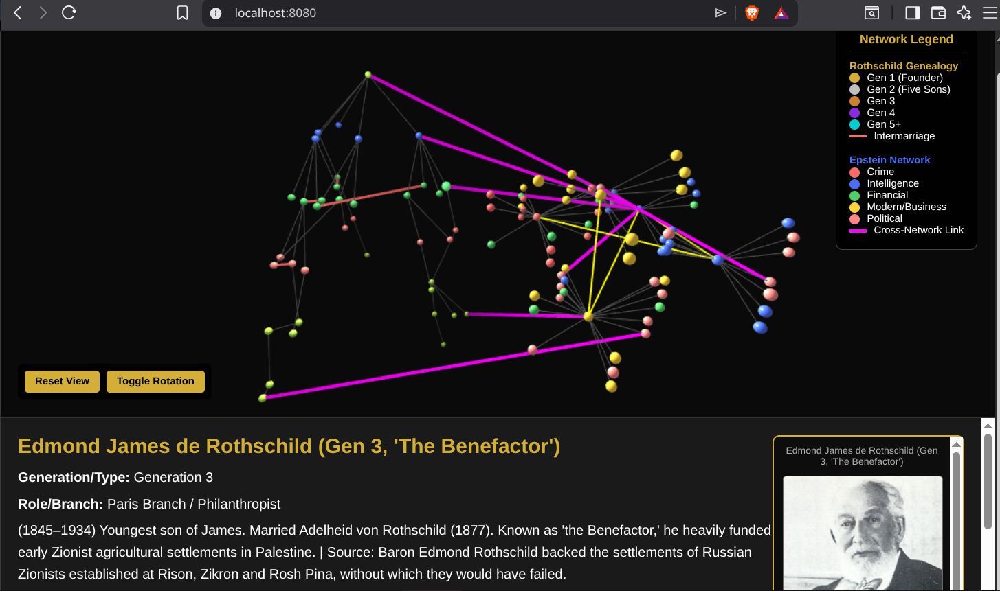

# Combined Rothschild & Epstein Network Map

An interactive, side-by-side 3D network visualization combining the historical Rothschild genealogy with the modern Epstein-associated network. This project merges two distinct datasets into a single, cohesive, and highly interactive web-based map.



## 🌟 Features

- **Dual Network Visualization**: Rothschild genealogy (Generations 1-6) and the Epstein-associated network are rendered side-by-side with distinct, color-coded schemas.
- **Cross-Network Connections**: Magenta links highlight documented historical and modern overlaps, intelligence ties, and financial relationships between the two networks.
- **Externalized Data**: All node, link, and image mapping data is cleanly separated into `data.json`, making updates and maintenance straightforward without touching the rendering logic.
- **Interactive Details Panel**: Click any node to reveal detailed notes, historical context, and associated headshot images (supporting both local assets and external URLs).
- **Custom Branding**: Includes a custom gold-gradient "R & E" favicon and updated page metadata.

## 🚀 Getting Started

Due to browser CORS restrictions on local `file://` protocols, this map must be served via a local HTTP server to load the external `data.json` file correctly.

### Prerequisites
- Python 3.x (for the local server)
- A modern web browser

### Running the Map
1. Clone or navigate to this repository:
   ```bash
   cd combined-map
   ```
2. Start a local HTTP server:
   ```bash
   python3 -m http.server 8080
   ```
3. Open your browser and navigate to:
   ```
   http://localhost:8080
   ```

## 📂 Project Structure

```text
combined-map/
├── index.html          # Main visualization logic and UI layout
├── data.json           # Centralized data: nodes, links, epsteinNodes, epsteinLinks, headshotImages
├── favicon.ico         # Custom "R & E" gold gradient favicon
├── favicon.svg         # Source SVG for the favicon
├── images/             # Local headshot images for both networks
├── resources/          # Additional media assets (e.g., reference maps)
└── README.md           # This file
```

## 🗄️ Data Structure (`data.json`)

The `data.json` file contains five main arrays/objects:
- `nodes`: Rothschild family members (identified by `gen > 0`).
- `links`: Connections between Rothschild nodes.
- `epsteinNodes`: Modern network figures (identified by `gen === 0` and an `epstein_type` property: `crime`, `intelligence`, `financial`, `modern`, `political`).
- `epsteinLinks`: Connections within the modern network.
- `headshotImages`: A dictionary mapping node names/IDs to their respective image paths (supports both local `images/` paths and external `http(s)://` URLs).

## 🛠️ Customization

- **Adding New Connections**: Edit `data.json` and append to the `links` or `epsteinLinks` arrays. Use `"type": "cross-connection"` for magenta inter-network links.
- **Updating Node Details**: Modify the `notes` property of any node in `data.json`. Changes will reflect immediately in the UI details panel upon refresh.
- **Styling**: All CSS is embedded in `index.html` under the `<style>` tag for easy tweaking of colors, spacing, and panel layouts.

## ⚠️ Disclaimer

This visualization is a research and educational tool. Connections and notes are derived from publicly available documents, historical records, and reported investigations (including declassified FBI/CHS reporting). It is intended for informational and analytical purposes only.

## 📜 License

This project is provided as-is for educational and research purposes. Ensure compliance with local laws regarding the use and distribution of publicly sourced intelligence and historical data.
